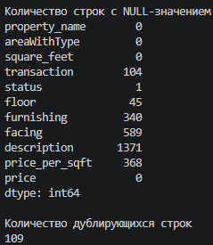
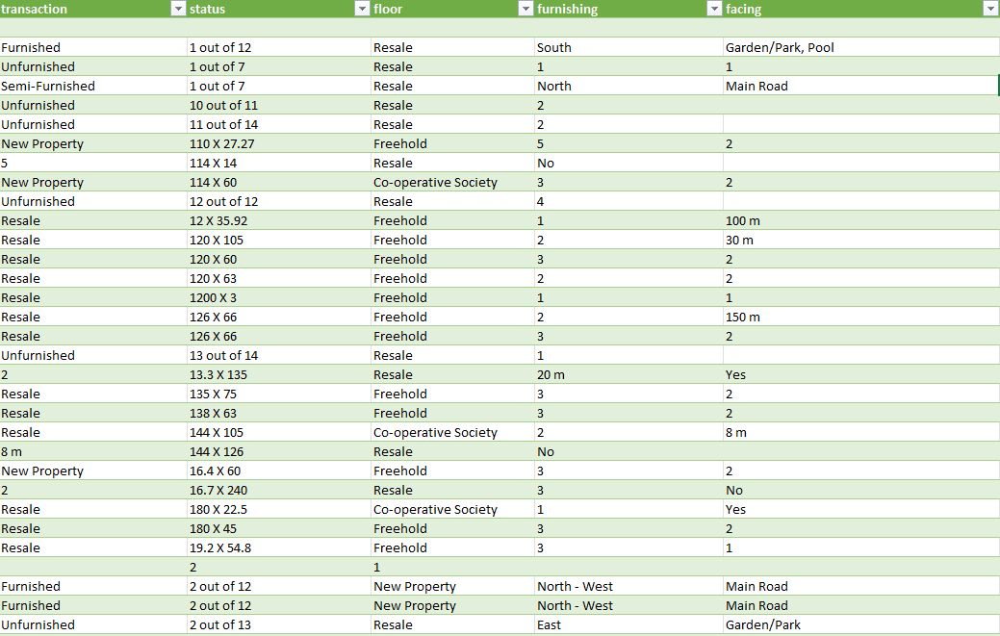
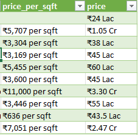

# Surat Real Estate: SQL Data Cleaning

Учебный проект: очистка "грязных" данных о недвижимости средствами SQL: дубли, пропуски, смещённые колонки, текстовые поля с валютой и единицами измерения.

## Стек
- Python (pandas): загрузка сырых данных
- PostgreSQL: хранилище и вся логика очистки

## Источник данных
[Surat Real Estate Dataset (Uncleaned) на Kaggle](https://www.kaggle.com/datasets/kunjadiyarohit/flats-uncleaned-dataset) - датасет объявлений о недвижимости с типичными проблемами качества данных

## Обнаружение проблем

### 1. Пропуски и дубли

### 2. Смещение значений между колонками

В колонках `transaction`, `status`, `floor`, `furnishing`, `facing` данные перемешаны, например, в `transaction` встречаются значения вроде "New Property", "5", "Resale", которые логически принадлежат разным полям, а в `status` размеры участков вида "110 X 27.27" вместо ожидаемого статуса сделки. Похоже, что при исходном парсинге сайта не все объявления содержали одинаковый набор характеристик, из-за чего значения сдвинулись в соседние колонки.

### 3. Несогласованные единицы измерения цены

Колонка `price` содержит два разных масштаба без явного разделения:
- **Lac** - сотни тысяч рупий (1 Lac = 100,000)
- **Cr**  - десятки миллионов (1 Cr = 10,000,000)

Например, `₹1.05 Cr` и `₹38 Lac` - визуально похожи по формату, но отличаются в 100 раз. Без преобразования к единому масштабу любая агрегация (сумма, среднее) будет некорректной. Аналогично `price_per_sqft` - текст с символом валюты, запятыми-разделителями тысяч и суффиксом "per sqft".

## Схема данных

Все поля на этапе staging хранятся как `VARCHAR`. Типизация и очистка происходят на уровне SQL, а не при загрузке, чтобы не потерять исходные "грязные" значения.
 
Полный файл — [`sql/create_table.sql`](sql/create_table.sql).

## Статус

- [x] Выбор датасета
- [x] Разведка проблем
- [x] Загрузка сырых данных в PostgreSQL
- [ ] SQL: удаление дублей
- [ ] SQL: разбор смещённых колонок
- [ ] SQL: приведение числовых полей к нужному типу
- [ ] Итоговый вывод: "было / стало"
